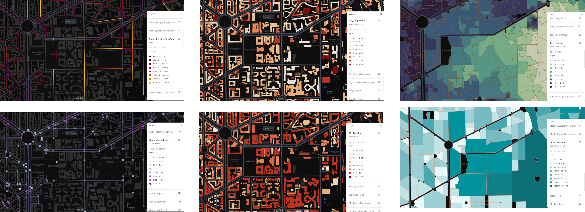

# UrbanMorphMetrics_Milano

## Contents

- [Introduction](#Introduction)
- [Overview](#Overview)
- [Instructions](#Instructions)
- [Reference](#Reference)

## Introduction

This project aims to quantify the morphological indicators of Milan through Momepy, showing the whole process from data input to calculation and obtaining the results of each indicator. [Momepy](https://docs.momepy.org/en/stable/#citing) is a library for quantitative analysis of urban form - urban morphometrics. It is part of PySAL (Python Spatial Analysis Library) and is built on top of GeoPandas, other PySAL modules and networkX.

## Overview

## Instructions

For detailed usage guide and environment configuration, please refer to [Momepy](https://docs.momepy.org/en/stable/#citing)

## Reference

Fleischmann, M. (2019) ‘momepy: Urban Morphology Measuring Toolkit’, Journal of Open Source Software, 4(43), p. 1807. doi: 10.21105/joss.01807.
 
